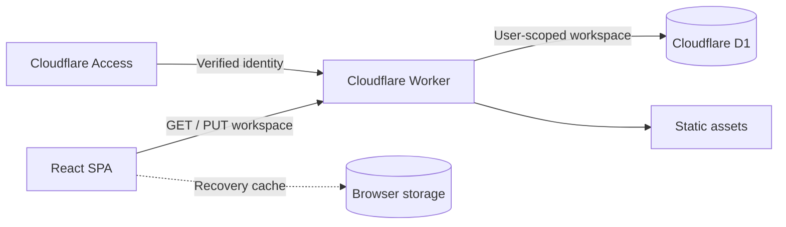

<p align="center">
  
</p>

<h1 align="center">EdgeTrader</h1>

<p align="center">
  <strong>A process-first trading journal, playbook builder, and risk workspace.</strong>
</p>

<p align="center">
  Built with React, Cloudflare Workers, Cloudflare Access, and D1.
</p>

<p align="center">
  <a href="https://github.com/7Kushal/NorthStar/issues">Report a bug</a>
  ·
  <a href="https://github.com/7Kushal/NorthStar/issues">Request a feature</a>
  ·
  <a href="https://github.com/7Kushal/NorthStar/pulls">Contribute</a>
</p>

---

EdgeTrader helps discretionary traders turn preparation, execution, and review into one repeatable workflow. It records more than P&L: every trade can retain its setup, emotions, notes, screenshots, playbook, and risk context.

The project is open source and self-hostable. We welcome traders, designers, frontend engineers, Cloudflare developers, data-visualization specialists, and documentation contributors.

> [!IMPORTANT]
> EdgeTrader is a journaling and review tool. It does not provide financial advice, execute broker orders, or guarantee trading outcomes.

## Why EdgeTrader?

Most journals describe what happened. EdgeTrader is being built to explain **why it happened** and whether the trader followed a repeatable process.

- **Prepare:** complete a structured pre-trade check and select an active playbook.
- **Execute:** record the instrument, direction, prices, size, management, and evidence.
- **Review:** assess emotions, mistakes, plan adherence, and execution quality.
- **Improve:** compare results across setups, weekdays, emotions, and accounts.

## Features

| Area | What is available |
| --- | --- |
| Trading journal | Calendar-based entries, trade review, notes, fees, lot size, open/close prices, emotions, grades, and screenshots |
| Strategy playbooks | Entry model, criteria, management rules, exits, strategy timeframe, visual examples, active-playbook state, and usage counts |
| Pre-trade gate | Mandatory market-structure questions, written context, emotion check-in, session acknowledgement, and Elefin handoff |
| Risk controls | Starting balance, maximum daily loss, maximum trades per day, default risk, and live readiness indicators |
| Analytics | Equity curve, P&L metrics, win/loss distribution, expectancy, weekday rhythm, setup performance, and emotion performance |
| Multi-account workspace | Separate journals, playbooks, settings, and analytics for each trading account |
| Cloud persistence | Cloudflare Access identity isolation, D1 storage, automatic sync, and a user-scoped recovery cache |
| Interface | Responsive light/dark themes, liquid-glass styling, drawers, image previews, and keyboard-friendly forms |

## Architecture



The Worker validates the Cloudflare Access identity before reading or writing a workspace. D1 stores one JSON workspace per authenticated user, while the browser keeps a user-scoped cache for recovery. Writes are same-origin only and workspace payloads are capped at 4.5 MB.

## Tech stack

- [React](https://react.dev/) for the application UI
- [Vite](https://vite.dev/) for development and production builds
- [Apache ECharts](https://echarts.apache.org/) for analytics and market visualizations
- [Cloudflare Workers](https://developers.cloudflare.com/workers/) for the application backend
- [Cloudflare D1](https://developers.cloudflare.com/d1/) for persistent workspace storage
- [Cloudflare Access](https://developers.cloudflare.com/cloudflare-one/applications/configure-apps/) for identity and access control
- [Lucide](https://lucide.dev/) for interface icons

## Quick start

### Prerequisites

- A recent Node.js LTS release
- npm

### Run locally

```bash
git clone https://github.com/7Kushal/NorthStar.git
cd NorthStar
npm install
npm run db:migrate:local
npm run start
```

Open [http://127.0.0.1:4173](http://127.0.0.1:4173).

Wrangler provides a simulated local Access user:

```text
Local Trader <local@edgetrader.dev>
```

The local D1 database persists between restarts. Local development does not require a Cloudflare login.

### Production build

```bash
npm run build
```

The Worker bundle and client assets are written to `dist/`.

## Self-host on Cloudflare

You need a Cloudflare account, a D1 database, and a Cloudflare Access policy.

### 1. Create your D1 database

```bash
npx wrangler login
npm run db:create
```

Copy the returned `database_id` into the `d1_databases` entry in `wrangler.jsonc`. Forks should use their own D1 database ID; do not rely on the database ID committed for the maintainer deployment.

### 2. Apply the schema

```bash
npm run db:migrate:remote
```

### 3. Configure Cloudflare Access

Create an Access application for your Worker and add an allow policy for the users who should be able to open EdgeTrader. Then update these values in `wrangler.jsonc`:

```jsonc
{
  "vars": {
    "TEAM_DOMAIN": "https://your-team.cloudflareaccess.com",
    "POLICY_AUD": "your-access-application-audience-tag"
  }
}
```

For a public deployment, review the authentication design before removing Access. The current workspace API expects a verified identity and intentionally rejects unauthenticated D1 requests.

### 4. Deploy

```bash
npm run build
npx wrangler deploy
```

For Cloudflare Workers Builds, use:

| Setting | Value |
| --- | --- |
| Build command | `npm run build` |
| Deploy command | `npx wrangler versions upload` |
| Root directory | `/` |

## Available scripts

| Command | Purpose |
| --- | --- |
| `npm run start` | Start local development at `127.0.0.1:4173` |
| `npm run build` | Create the production Worker and client bundles |
| `npm run preview` | Preview the production client locally |
| `npm run db:migrate:local` | Apply D1 migrations to the local database |
| `npm run db:migrate:remote` | Apply D1 migrations to the configured remote database |
| `npm run db:create` | Create a new `edgetrader-prod` D1 database |

## Project structure

```text
.
├── migrations/                 # D1 schema migrations
├── public/                     # Static icons and public assets
├── src/
│   ├── hooks/
│   │   ├── useAccountWorkspace.js
│   │   ├── useEconomicCalendar.js
│   │   └── useLocalState.js
│   ├── App.jsx                 # Product UI and workflows
│   ├── main.jsx                # React entry point
│   └── styles.css              # Light, dark, responsive, and glass styling
├── worker/
│   └── index.js                # Access verification and workspace APIs
├── package.json
└── wrangler.jsonc
```

## Contributing

Contributions of every size are welcome.

1. Fork the repository.
2. Create a focused branch: `feat/short-name`, `fix/short-name`, or `docs/short-name`.
3. Make the change and keep it scoped to one concern.
4. Run `npm run build`.
5. Test the affected workflow in both light and dark mode.
6. Open a pull request explaining the problem, approach, and verification performed.

For a substantial product or architecture change, open an issue first so the direction can be discussed before implementation.

### Pull request checklist

- [ ] The production build passes.
- [ ] No real trading data, credentials, Access tokens, or secrets are committed.
- [ ] New UI works on desktop and mobile layouts.
- [ ] Light and dark themes remain readable.
- [ ] Empty, loading, error, and populated states are considered.
- [ ] D1 changes include a forward migration in `migrations/`.
- [ ] User-facing behavior is documented when necessary.

### Good first contributions

Looking for a place to begin? These areas are especially valuable:

- Add unit and integration tests for workspace normalization and Worker APIs.
- Improve keyboard navigation, focus management, and screen-reader labels.
- Extract reusable UI components from `App.jsx`.
- Add CSV import/export with broker-agnostic field mapping.
- Improve image-storage efficiency and attachment lifecycle handling.
- Add conflict-aware offline sync and clearer recovery tools.
- Expand analytics with filters and statistically responsible insights.
- Improve documentation, onboarding, and deployment automation.

Please check the [issue tracker](https://github.com/7Kushal/NorthStar/issues) before starting, and comment on an existing issue if you want to take it.

## Design principles

Contributions should preserve these product principles:

1. **Process before outcome** — reward disciplined execution, not only profitable trades.
2. **Real user data only** — do not silently inject demo trades or fabricated market history.
3. **Fast review** — common journal actions should stay obvious and low-friction.
4. **Private by default** — identity boundaries and user-scoped storage must remain explicit.
5. **Calm interfaces** — use motion, color, and glass effects to communicate hierarchy, not decoration alone.
6. **Mobile-aware** — drawers, forms, charts, and calendars must remain usable on narrow screens.

## Data and privacy

- Cloudflare Access supplies the authenticated identity.
- Each D1 workspace is keyed by that identity.
- Accounts inside a workspace keep independent trades, playbooks, sessions, settings, and analytics.
- The browser stores a user-scoped cache for recovery and faster hydration.
- Uploaded images are compressed in the browser before synchronization.
- Logging out does not intentionally erase journal data.

If you deploy EdgeTrader for other people, you are responsible for your own privacy policy, data-retention policy, Access rules, backups, and regulatory obligations.

## Roadmap

- [ ] Automated frontend and Worker test suites
- [ ] Broker-neutral CSV import and export
- [ ] Optional broker connectors behind explicit user authorization
- [ ] Advanced filtering and analytics comparisons
- [ ] Improved offline and sync-conflict handling
- [ ] Accessible chart summaries and report exports
- [ ] Contributor documentation and reusable component library

Roadmap items are directions, not release commitments. Proposals and pull requests are welcome.

## License

EdgeTrader is licensed under the [Apache License 2.0](LICENSE).

By contributing, you agree that your contribution will be licensed under the same license.

---

<p align="center">
  Built for traders who want evidence, not guesswork.
</p>
